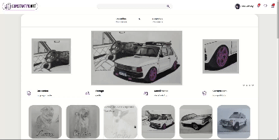

 <h1>Constantino Art Store</h1>  
  
It's a simple website that i made just to show my drawings, it's not supposed to work completely as an store, it's just a creative way to show you all my art work.

  
  
  
You can check the page, and see it working <a href="https://yasminconstantino.github.io/Constantino-Art-/">here</a>

  <h4> Languages and Technologies:</h4>
  

    
    
    
  

 
<h5>...</h5>
 
<section>
  

    
Clique aqui para ler em português

    
EEsse é um site bem simples que eu fiz apenas pra mostrar os meus desenhos, ele não foi feito para funcionar como uma loja, é apenas um jeito criativo de mostrar a minha arte..

    
Você pode acessar a página e ver ela funcionando <a href="https://yasminconstantino.github.io/Constantino-Art-/">aqui</a>

    <h4>Linguagens e tecnologias utilizadas:</h4>
  

    
    
    
  

  

</section>

